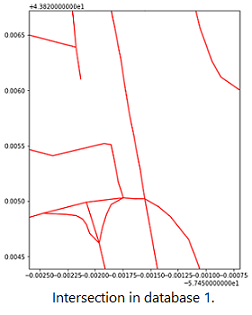
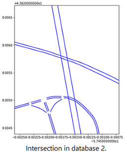

&nbsp;
# Project 1: Alphanumeric CAPTCHA Solver
[Full Article Link](https://github.com/Ceudan/Alphanumeric-CAPTCHA-Solver)
 [Video Link](https://drive.google.com/file/d/1td802b0Awh8pfEoDKK6pBHAdh1UC6BsB/view?usp=sharing)

Led a team of 4 to design a multi-staged software that decodes alphanumeric CAPTCHA images. Motivation was a course final project. Input consists 5 character CAPTCHAs disguised with various levels of rotational, distance, colour and overlapping distortions along with image noise. Output is a 5 character prediction of the sequence.
 
\
The program consists of 3 main steps: preprocessing using computer vision libraries to eliminate noise, character segmentation using object recognition to localize individual characters, and character classification using a convolutional neural network followed by several fully connected layers. We succesfully achieved an accuracy of 71% per entire CAPTCHA image and 91% per individual character. These accuracies are high given that CAPTCHAs are designed not to be bypassed by computer software. 
\
\
Skills Learned: computer vision libraries, image processing, deep-learning, generating custom train data

# Project 2: Matching Road Sections between Databases
[Full Article Link](https://github.com/Ceudan/Match-Roads-Between-Databases)

I independantly wrote a program from scratch to figure out which road sections in database 1 corresponds to those in database 2 using geospatial data. This was one of the many tasks recieved at the University of Toronto Transportation Research Institute. Hurdles include:
- over 100,000 road sections per database (strong time complexity requirements)
- close proximity does not gaurentee correct match
- geographic coordinates carry up to 10 metres of uncertainty


   


Achieved an accuracy of 94% when excluding abnormally sections. Accuracy is highly dynamic since adjustable thresholds can tradeoff quantity with quality. It was succesfully used to match sections from an Aimsun traffic simulation covering the GTHA, with HERE Technologies' observed traffic information.
\
\
Skills Learned: GeoPandas, GIS, shapefiles, shapely visualizations, matrix/array operation time dependancies

# Markdown 

Markdown is a lightweight and easy-to-use syntax for styling your writing. It includes conventions for

```markdown
Syntax highlighted code block

# Project 1
## Project 2
### Project 3

- Bulleted
- List

1. Numbered
2. List

**Bold** and _Italic_ and `Code` text

[Link](url) and 
```

For more details see [Basic writing and formatting syntax](https://docs.github.com/en/github/writing-on-github/getting-started-with-writing-and-formatting-on-github/basic-writing-and-formatting-syntax).

### Jekyll Themes

Your Pages site will use the layout and styles from the Jekyll theme you have selected in your [repository settings](https://github.com/Ceudan/Coden_Portfolio/settings/pages). The name of this theme is saved in the Jekyll `_config.yml` configuration file.

### Support or Contact

Having trouble with Pages? Check out our [documentation](https://docs.github.com/categories/github-pages-basics/) or [contact support](https://support.github.com/contact) and we’ll help you sort it out.
