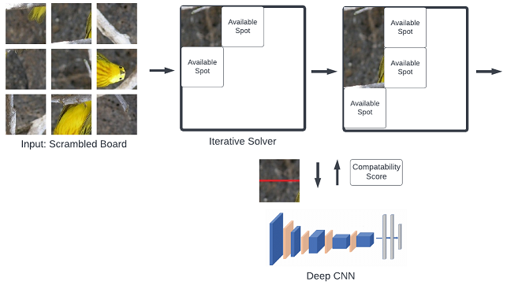

&nbsp;
# Learning Reinforcement Learning via Car Racing
[Article Link](https://github.com/Ceudan/Car-Racing)

I hand coded multiple reinforcement learning algorithms for the openai Car Racing environment. Namely I applied Double Deep Q networks and Proximal Policy Optimization. The purpose of this project was to become familiar with RL libraries, algorithms and hyperparameter tuning. To prevent simply copying other's solutions, I gave myself a research question. That is, can I officially beat the environment at a lower computational cost than others?

https://user-images.githubusercontent.com/78922263/177021714-fc82a6ff-e44c-4936-bf50-61a8f3a372f1.mp4

My PPO project was very succesfull, obtaining the highest test score and beating the environment at the 2nd lowest training cost than all other implementations on OpenAI's official leaderboard (917/900 reward averaged over 100 test episodes, after 925 training episodes). I used a novel never seen before method for the environment, that is I seperated the steering and thrust actions to 2 independantly trained networks to simplify the learnable relationship. DDQN did not officially beat the environement, but it also succesfully achieved a relatively high score at low training costs (850/900 after 360 training episodes).

# Alphanumeric CAPTCHA Solver
[Article Link](https://github.com/Ceudan/Alphanumeric-CAPTCHA-Solver)

Led a team of 4 to independently design from scratch a multi-staged software that decodes alphanumeric CAPTCHA images. Motivation was a course final project. Input consists of 5 character CAPTCHAs disguised with noise and various levels of overlap, rotational, distance and colour distortions. Output is a 5 character prediction of the sequence.

 

Stages:
\
&#8291;1. Preprocessing using computer vision libraries to eliminate noise.
\
&#8291;2. Character segmentation using object recognition to localize individual characters.
\
&#8291;3. Character classification using a convolutional neural network followed by several fully connected layers.

Achieved mark of 90%. Achieved an accuracy of 71% per entire CAPTCHA image and 91% per individual character. These accuracies are high given that CAPTCHAs are designed not to be bypassed by computer software. 
\
\
Skills Learned: computer vision libraries, image processing, deep-learning, generating custom train data

# Predicting Student Question Performance
[Article Link](https://github.com/Ceudan/Predicting-Student-Question-Performance)

Led a team of 3 to write an ensemble machine learning model with bagging to predict a student's performance on diagnostic questions. Our ensemble combined 3 distinct algorithms. Motivation was a course project.

Given Data

Model Architecture

Achieved mark of 97%. We ranked 18th in a coursewide competition (over 300 eligible competitors) with an accuracy of 70.3%. After fixing bugs and updating model to current version, accuracy increased to 71.3%, which would have ranked us 5th place.
\
\
Skills Learned: pytorch, autograd, optimization, bagging, ensemble

# Sliding Puzzle Solver
[Virtual Game Link](https://www.proprofsgames.com/puzzle/sliding/mona-lisaq/)

There are 2 distinct stages to this puzzle. First, you must estimate the original configuration of the subpieces. Second, you must find a way to rearrange the subpieces into the original configuration while obeying the constraints of the game.

### Subtask 1: Original Configuration Estimation
[Article Link](https://github.com/Ceudan/Sliding-Puzzle-Solver/blob/main/README.pdf)

Worked in a team of 3 leveraging Deep CNN's and advanced combinatoric algorithms for the task. This subtask is identical to that of solving square jigsaws. Pipeline consisted of pre-processing raw scenic images into the puzzle structure, fine-tuning pretrained Deep CNN's to predict the likelihood of sub-peices being conjoined, then utilising a deterministic solving algorithm to estimate most the likely configuration.

All Deep CNN's achieved an adjacency prediction accuracy of over 90%. Importantly, by testing various pre-trained architectures such as RESNet, RESNext and VGG we were able to deduce useful insights regarding the application of CNN's to the problem. Namely, shorter wider CNN's outperform deeper ones. This was due to the models facing significant error when comparing images lacking in large features (ex. subpieces of the sky), where localized pixel level details become critical. We hypothesiszed this may prove difficult for Deep CNN's where location and low level information is lost in its deeper layers, especially when tuning models pretrained for object recognition. 

### Subtask 2: Tile Rearrangement
One day I hope to have enough time to return and complete this section comparing various reinforcement learning techniques.

# Matching Road Sections between Databases
[Article Link](https://github.com/Ceudan/Match-Roads-Between-Databases)

I independently created software to match sections across databases using geospatial information. This was one of the many tasks I recieved at the University of Toronto Transportation Research Institute. Hurdles included:
- over 100,000 road sections per database (strong time complexity requirements)
- close proximity does not gaurentee correct match
- geographic coordinates carry up to 10 metres of uncertainty

   

Achieved an accuracy of 94% on normal road types. Accuracy is dynamic since adjustable thresholds can tradeoff quantity with quality. It was succesfully used to match sections from an Aimsun traffic simulation covering the GTHA, with HERE Technologies' observed traffic information.
\
\
Skills Learned: GeoPandas, GIS, shapefiles, search algorithms, matrix/array time dependancies
